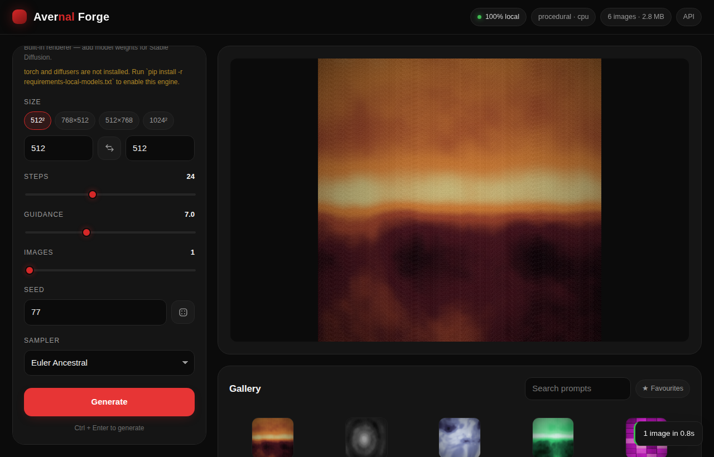
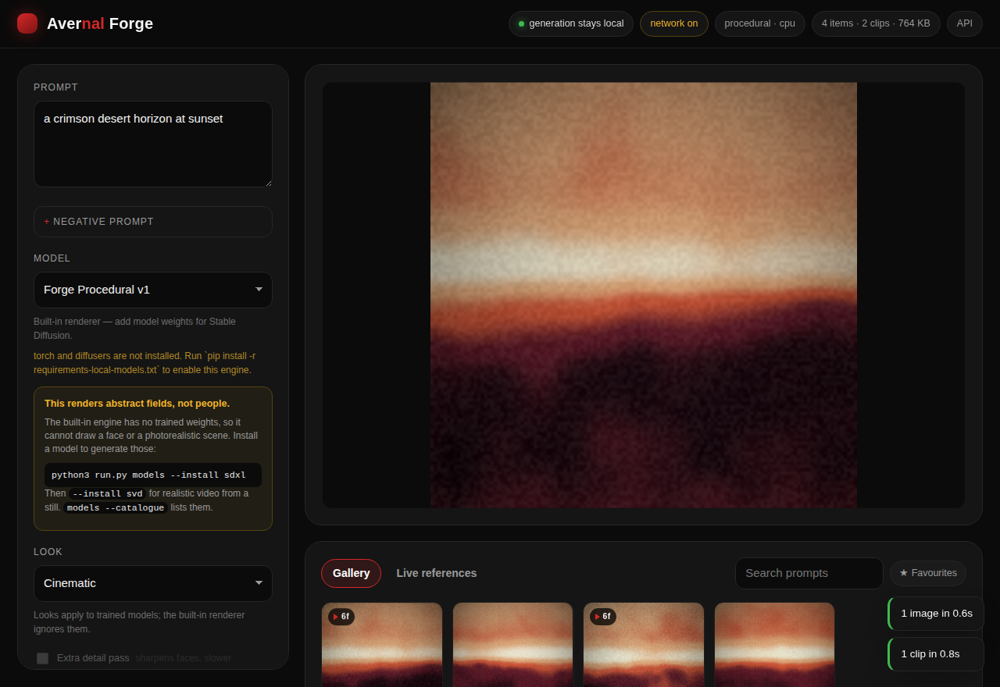
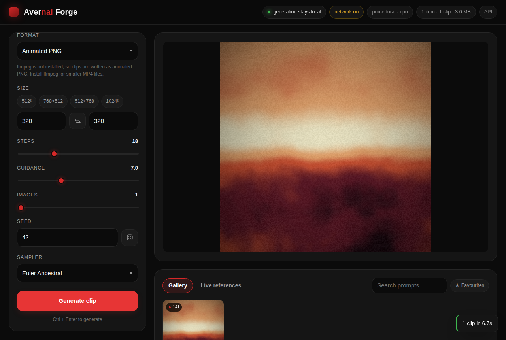
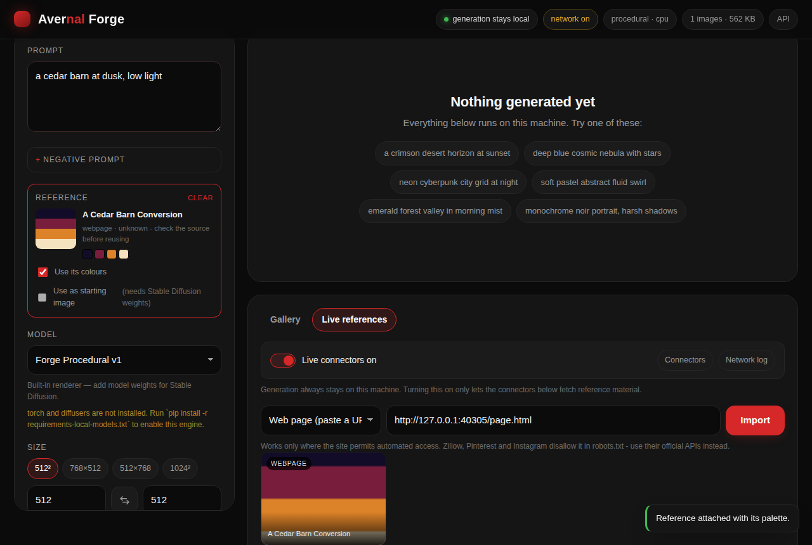

# Avernal Forge

Image generation that runs entirely on your own machine — and serves its own
API, so other tools can use **Forge** as their image provider instead of a
hosted service.

Images and short video clips, generated on your own machine - including
photorealistic people, once you install a model that can draw them.

**Generation never touches the network.** Prompts, models and output stay on
your machine, always. There is no telemetry, no account, and no model hub: if a
model is not already on your disk, Forge will not fetch it for you.

Separately, and switched **off by default**, Forge can pull in live reference
material - Wikipedia, Wikimedia Commons, Openverse, Reddit, Pinterest, Mastodon,
Bluesky, MLS listings, or any page you paste. That traffic goes through one
audited gate with a host allowlist, and you can see every request it made. See
[Live references](#live-references).



---

## Quick start

```bash
python3 run.py
```

That is the whole setup. Open <http://127.0.0.1:8787> and generate. Forge needs
**nothing but Python 3.10+** — no pip install, no virtualenv, no Node, no
network. The server, the gallery database, the PNG encoder and the built-in
renderer are all standard library.

Generated images land in `~/.avernal-forge/outputs`, indexed in a SQLite
gallery beside them.

---

## Realistic people and video

Photorealism comes from **model weights**, not from settings. Forge's built-in
renderer paints abstract colour fields; it has no trained weights and cannot
draw a face, and no option will change that. What it *can* do is run the models
that draw faces very well - so the job is getting those weights onto your
machine.

One command each:

```bash
python3 run.py models --catalogue        # what is on offer, with sizes and VRAM
python3 run.py models --install sdxl     # photorealistic stills, people included
python3 run.py models --install svd      # realistic video from a still (gated)
pip install -r requirements-local-models.txt
python3 run.py
```



Any Hugging Face repository works too, not just the catalogue:

```bash
python3 run.py models --install stabilityai/stable-diffusion-xl-base-1.0
```

Gated models (Stable Video Diffusion among them) need their licence accepted on
the model page first, then `--hf-token YOUR_TOKEN` or `HF_TOKEN` in the
environment. Installs resume if interrupted - re-run the same command.

**This is the only part of Forge that downloads anything, and it only runs when
you type it.** Generation never touches the network, and neither does startup.
Installs go through the same audited gate as everything else, so they appear in
the network log.

### Looks

The **Look** menu adds the prompt and negative-prompt vocabulary that makes the
difference between an illustration and a photograph - lens and lighting terms
on the way in, and the failure modes worth excluding on the way out.

| Look | For |
| --- | --- |
| **Photographic** | Reads as a photo rather than an illustration |
| **Portrait of a person** | Faces: skin texture, catchlights, and the negatives that keep hands and eyes right |
| **Cinematic** | Film-still framing, shallow focus, graded colour |
| **Documentary** | Available light, unposed, reportage |

Your own prompt always comes first and your own negative always wins, so a Look
never quietly overrides what you typed. The prompt is stored as you wrote it;
what actually went to the model is recorded alongside it.

Looks only affect trained models. The procedural renderer reads prompts for
colour and composition words, so lens vocabulary would only confuse it - it
takes your prompt as typed, and the studio says so.

### Detail pass

**Extra detail pass** re-renders the result larger at low strength - the
standard "hires fix". The first pass settles the composition, the second adds
the detail faces and fabric need, without the duplicated limbs that generating
large in one pass tends to produce. It shares the already-loaded weights, so it
costs time rather than VRAM.

### What to expect

| Want | Install | VRAM |
| --- | --- | --- |
| Photoreal stills, people | `sdxl` | ~8GB |
| Same, on a smaller card | `sd21` | ~6GB |
| Fast drafts | `sdxl-turbo` | ~8GB |
| Realistic video from a still | `svd` | ~12GB |
| Text-to-video | `ltx-video` | ~12GB |

On CPU these run, but slowly enough that a single SDXL image is minutes rather
than seconds. A GPU is what makes this practical.

## Three engines

| Engine | Needs | Makes | What it is |
| --- | --- | --- | --- |
| **Procedural** (built in) | nothing | stills and clips | A prompt-conditioned renderer. Reads your prompt for colour, mood and composition cues and paints layered domain-warped noise fields through a derived palette. |
| **Stable Diffusion** (optional) | `torch` + `diffusers` + weights on disk | stills | Real SD 1.x / 2.x / SDXL inference, loaded from local files only. |
| **Video diffusion** (optional) | `torch` + `diffusers` + video weights | clips | Stable Video Diffusion, AnimateDiff, LTX, CogVideoX or Wan - whichever you put in the models folder. |

The procedural engine is **not a neural model and never pretends to be one**.
It renders abstract fields, not people or places. It exists so the app works
the moment you clone it, and so there is always a renderer when no weights are
installed. It is deterministic: the same prompt and
seed always produce the same image, and prompts genuinely steer the result —
`emerald forest` is green, `crimson sunset` is warm, `geometric city grid`
composes as architecture, `cosmic nebula` gets stars.

### Turning on real Stable Diffusion

```bash
pip install -r requirements-local-models.txt          # torch, diffusers, …
cp -r /path/to/stable-diffusion-model ~/.avernal-forge/models/
python3 run.py models                                 # confirm it was found
python3 run.py
```

Forge prefers **diffusers-format folders** (a directory containing
`model_index.json`) because those load cleanly offline. Single-file
`.safetensors` / `.ckpt` checkpoints also work, but they need their pipeline
config available locally too — pass `--sd-config /path/to/config-folder` if
loading one fails.

Models already in your Hugging Face cache are picked up automatically. Nothing
is ever downloaded: every load passes `local_files_only=True`.

Forge picks CUDA, then MPS, then CPU. Override with `--device`, and add
`--offload` if VRAM is tight.

---

## Video

Switch the output from **Image** to **Video** in the studio, or send
`"kind": "video"`. Clips are short, loop seamlessly, and carry their own frame
count and rate.

The built-in procedural engine animates with no weights and no dependencies: it
walks the noise field's sampling point around a circle, so the last frame runs
back into the first with no visible seam. Frame 0 of a clip is exactly the still
you would get from the same seed, which makes it easy to find a composition
first and then set it moving.



### Output formats

| Format | Needs | Notes |
| --- | --- | --- |
| **MP4** (H.264) | ffmpeg on your machine | Preferred when available: smaller and seekable |
| **Animated PNG** | nothing | Written with the standard library alone, and plays in every current browser |

Forge picks MP4 when ffmpeg is installed and animated PNG otherwise, so video
works on a machine with nothing installed at all - the same promise the rest of
the app makes. Force one with `video_format`.

Animated PNG is lossless and stores whole frames, so it is **much** larger than
MP4: a 320x320 14-frame clip lands around 3MB where H.264 would be tens of
kilobytes. If you plan to make more than the occasional clip, install ffmpeg.

```bash
curl -X POST http://127.0.0.1:8787/api/generate \
  -H 'Content-Type: application/json' \
  -d '{"prompt": "a drifting crimson horizon", "kind": "video",
       "width": 512, "height": 512, "frames": 24, "fps": 12, "motion": 1.0}'
```

`frames` (2-240), `fps` (1-60) and `motion` (0-2, where 0 holds still) shape the
clip. Video has a tighter per-frame size cap than stills, because frames
multiply the cost of every pixel.

### Real video models

Drop a diffusers video model folder in `~/.avernal-forge/models/` and Forge
picks it up. The pipeline class in its `model_index.json` decides how it is
driven, so SVD, AnimateDiff, LTX, CogVideoX and Wan all work through one engine,
and Forge passes only the arguments that pipeline actually accepts.

Image-to-video models such as SVD need a starting frame: attach a reference, or
generate a still and use it as the starting image. Budget roughly 8GB of VRAM
for AnimateDiff, 10-16GB for SVD, and more for CogVideoX or Wan; `--offload`
trades speed for VRAM.

## Live references

Turn on **Live references** in the studio (or start with `--online`) and Forge
can fetch material to work from: an article, a photograph, a listing, a post.
Attach one and it feeds generation two ways - its colours become the palette,
and with Stable Diffusion weights installed it can be the starting image for
img2img.

Palettes are sampled in your browser from the saved copy, so it works for every
image format the page can display.



### What you can connect

| Source | Needs | What you get |
| --- | --- | --- |
| **Wikipedia** | nothing | Article summaries and lead images |
| **Wikimedia Commons** | nothing | Freely licensed photography, with attribution |
| **Openverse** | nothing (token optional) | Several hundred million openly licensed images |
| **Web page** | nothing | Paste any URL; title, description, preview image or `og:video` clip |
| **Reddit** | your own app id + secret | Public post search, images and hosted video, via the official OAuth API |
| **Pinterest** | your own access token | Your own pins and boards |
| **Mastodon** | an instance host | Public hashtag timelines, their images and their clips |
| **Bluesky** | handle + app password | Public post search and images |
| **Real estate** | MLS/Bridge endpoint + token | Live listings and photos over the RESO Web API |

Keys are stored in `~/.avernal-forge/connectors.json` with `0600` permissions,
or supplied as `AVERNAL_FORGE_<CONNECTOR>_<FIELD>` environment variables if you
would rather not write them to disk. They are never returned by the API, never
logged, and never sent anywhere except the service they belong to.

Check that the live endpoints actually answer:

```bash
python3 run.py connectors           # what is set up
python3 run.py connectors --check   # make one real request per connector
```

### What is deliberately missing

Some platforms have no route that an app can use honestly, so Forge does not
pretend otherwise:

- **Zillow** retired its public listings API in 2021, and both its terms and its
  robots.txt prohibit scraping listing pages. The route that does exist is the
  **RESO Web API** feed your MLS or [Bridge Interactive](https://bridgedataoutput.com/)
  (a Zillow Group company) issues to licensed brokers, agents and their vendors -
  that is the "Real estate" connector above.
- **Pinterest** has no site-wide search in its API. Only your own pins and boards
  are reachable, which is what the connector uses.
- **Instagram** retired the Basic Display API in 2024; the Graph API covers
  business and creator accounts only.
- **TikTok** requires per-app approval, and **X** charges for API access.

For any of these, the honest paths are the same two: use the official API with
your own approved credentials, or paste a URL you have the rights to use.

### How the network gate works

Every outbound request goes through one chokepoint that:

- refuses everything while live references are off;
- allows only hosts belonging to a connector you enabled **and** configured;
- re-checks the allowlist on every redirect, so a 302 cannot walk off it;
- refuses private, loopback and link-local addresses, so a misconfigured
  endpoint cannot be pointed at cloud metadata;
- caps response size and time;
- records every attempt, with credentials stripped, in **Network log**.

Two things worth knowing. Search-result thumbnails are loaded directly by your
browser from the source site, exactly as on any web page, so they do not appear
in the log; anything Forge *saves* is downloaded through the gate and does.
And a URL you paste is judged on the site's robots.txt rather than the
allowlist, because you chose it - sites that disallow automated access are
refused, and Forge tells you which and why.

## Forge as your image provider

The server speaks an OpenAI-compatible images API, so existing clients work
against it unchanged:

```bash
curl -X POST http://127.0.0.1:8787/v1/images/generations \
  -H 'Content-Type: application/json' \
  -d '{"prompt": "a crimson desert horizon", "size": "512x512", "n": 1}'
```

```python
from openai import OpenAI

# Any api_key value works: Forge is local and unauthenticated by default.
client = OpenAI(base_url="http://127.0.0.1:8787/v1", api_key="local")
image = client.images.generate(prompt="a crimson desert horizon", size="512x512")
```

`response_format` accepts `b64_json` (default) or `url`. Extra fields —
`steps`, `guidance`, `seed`, `sampler`, `negative`, `engine` — are honoured when
present and ignored by clients that do not send them.

---

## API reference

### Native API

| Method | Path | Purpose |
| --- | --- | --- |
| `GET` | `/api/health` | Liveness, active engine, device, queue depth |
| `GET` | `/api/config` | Engines, models, samplers, limits, defaults, stats |
| `GET` | `/api/models` | Models found on this machine |
| `POST` | `/api/generate` | Queue a job → `202` with the job record |
| `GET` | `/api/jobs` · `/api/jobs/{id}` | Job status and progress |
| `POST` | `/api/jobs/{id}/cancel` | Cancel a queued or running job |
| `GET` | `/api/events` | Server-sent events: live progress and finished images |
| `GET` | `/api/gallery` | Paged gallery — `limit`, `offset`, `q`, `favorites` |
| `GET` | `/api/gallery/{id}` | One image record |
| `POST` | `/api/gallery/{id}/favorite` | Star or unstar |
| `DELETE` | `/api/gallery/{id}` | Delete the record and the file on disk |
| `GET` | `/images/{file}` | The generated PNGs |

Live references (all refuse to reach anything while networking is off):

| Method | Path | Purpose |
| --- | --- | --- |
| `GET` | `/api/connectors` | Connector state, and which hosts are reachable |
| `POST` | `/api/connectors/online` | Turn live references on or off |
| `POST` | `/api/connectors/{id}/enabled` | Switch one connector on or off |
| `POST` · `DELETE` | `/api/connectors/{id}/credentials` | Store or clear your keys |
| `POST` | `/api/connectors/{id}/check` | One live request, for diagnostics |
| `GET` | `/api/references/search` | `connector`, `q`, `limit` |
| `POST` | `/api/references/import` | Import a pasted `url` |
| `GET` · `POST` | `/api/references` | List, or save one locally |
| `DELETE` | `/api/references/{id}` | Forget a saved reference |
| `GET` | `/api/network/log` | Every outbound request, credentials stripped |
| `GET` | `/refs/{file}` | Saved reference images |

### Provider API

| Method | Path | Purpose |
| --- | --- | --- |
| `POST` | `/v1/images/generations` | OpenAI-compatible, blocks until the image is ready |
| `GET` | `/v1/models` | OpenAI-compatible model listing |

Generation parameters and their limits: `prompt` (required), `negative`,
`width`/`height` (64–4096, rounded to a multiple of 8, max 8.4M pixels total),
`steps` (1–150), `guidance` (0–30), `batch`/`n` (1–8), `seed` (−1 for random),
`sampler`, `model`, `engine`, plus `init_image` + `strength` for img2img on the
diffusers engine. A request may also carry `palette` (hex colours sampled from a
reference) and `reference_id` (a saved reference to start the image from).
For clips: `kind` ("image" or "video"), `frames`, `fps`, `motion` and
`video_format` ("auto", "mp4" or "apng"). For realism: `style` (a Look id) and
`detail_pass`.

Every PNG carries its own recipe as embedded metadata, so an image dragged out
of the outputs folder still knows the prompt, seed and settings that made it.

---

## Command line

```bash
python3 run.py                                  # start the studio (default)
python3 run.py serve --port 9000 --open         # pick a port, open a browser
python3 run.py generate "a quiet harbour at dusk" -o harbour.png
python3 run.py generate "twin moons" -n 4 --size 768x512 --steps 30 --seed 42
python3 run.py models                           # what weights are on this machine
python3 run.py models --catalogue               # what Forge can install
python3 run.py models --install sdxl            # get photoreal weights
python3 run.py connectors                       # live reference sources
python3 run.py connectors --check --online      # do those endpoints actually answer?
```

Useful `serve` flags:

| Flag | Effect |
| --- | --- |
| `--host` / `--port` | Bind address (defaults to `127.0.0.1`, local only) |
| `--engine` | `auto`, `diffusers` or `procedural` |
| `--model` | Model id, name or path to prefer |
| `--device` | `auto`, `cuda`, `mps`, `cpu` |
| `--models` | Extra folder to scan for weights |
| `--workers` | Concurrent renders (keep at 1 for a single GPU) |
| `--api-key` | Require a bearer token on API requests |
| `--cors` | Allow cross-origin browser calls (off by default) |
| `--offload` | Enable model CPU offload to save VRAM |
| `--online` | Allow live connectors to fetch reference material |
| `--allow-private-hosts` | Let connectors reach LAN hosts (a self-hosted Mastodon) |

---

## Staying local

- **Generation never uses the network**, whatever else is switched on. Your
  prompts, images and clips are not sent anywhere, ever.
- Live references are **off until you turn them on**, and only reach hosts
  belonging to a connector you enabled and configured.
- Forge binds to `127.0.0.1` by default: nothing outside your machine can reach it.
- CORS is **off** unless you pass `--cors`, so a web page you happen to be
  visiting cannot drive your Forge instance.
- Model loading is `local_files_only=True` on every path.
- There is no telemetry, no update check and no analytics.

The studio's badge tells you which mode you are in: *100% local* when nothing
can leave, *generation stays local* plus a *network on* marker when connectors
are live.

## Generating people

Forge leaves each model's own safety checker in place rather than switching it
off, and tells you when a result was filtered instead of handing back a blank
frame. Note that single-file checkpoints often ship without a checker at all.

Realistic images of people carry obligations that a local tool cannot enforce
for you: don't generate identifiable real people without their consent, and
check the licence of the model you installed - several in the catalogue are
non-commercial. Forge deliberately has no face-swap or identity-transfer
feature.

If you bind to a LAN address, set `--api-key` as well — the server warns you at
startup when you do not. The studio prompts for that key and stores it in the
browser; the event stream accepts it as a `?key=` parameter because
`EventSource` cannot send headers.

---

## Layout

```
forge/
├── run.py                       zero-install launcher
├── avernal_forge/
│   ├── __main__.py              CLI: serve / generate / models / connectors
│   ├── config.py                paths and generation limits
│   ├── server.py                HTTP server, REST + OpenAI-compatible API
│   ├── jobs.py                  queue, progress, cancellation, event bus
│   ├── storage.py               SQLite gallery
│   ├── models.py                local weight discovery (no network)
│   ├── png.py                   PNG and animated-PNG encoders
│   ├── video.py                 MP4 via ffmpeg, animated PNG otherwise
│   ├── catalogue.py             models Forge can install, with sizes and licences
│   ├── installer.py             the only code that downloads anything
│   ├── presets.py               Looks: prompt and negative vocabulary
│   ├── engines/
│   │   ├── base.py              engine contract
│   │   ├── procedural.py        built-in renderer, stills and clips
│   │   ├── diffusers_engine.py  local Stable Diffusion / SDXL
│   │   └── diffusers_video.py   local SVD / AnimateDiff / LTX / CogVideoX / Wan
│   └── connectors/
│       ├── net.py               the network gate: allowlist, caps, audit log
│       ├── base.py              connector contract
│       ├── store.py             connector settings and your keys (0600)
│       ├── wikimedia.py         Wikipedia and Commons
│       ├── openverse.py         openly licensed image search
│       ├── webpage.py           paste-a-URL import, robots.txt aware
│       ├── reddit.py            official OAuth API
│       ├── pinterest.py         official v5 API, your own pins
│       ├── social.py            Mastodon and Bluesky
│       └── reso.py              licensed MLS listings
├── web/                         the studio UI (no build step, no CDN)
└── tests/
    ├── test_smoke.py            end-to-end tests against a live server
    ├── test_connectors.py       connectors and the network gate
    ├── test_video.py            encoders, animation, storage migration
    ├── test_realism.py          catalogue, installer, Looks
    ├── test_cli.py              every command, as a real subprocess
    ├── test_engines_offline.py  diffusers engines against fake torch
    ├── fake_torch.py            thin stand-ins for torch/diffusers/PIL
    ├── browser_regression.js    the studio driven in a real browser
    └── mock_upstreams.py        recorded upstream response shapes
```

## Tests

```bash
python3 -m unittest discover -s tests
```

177 tests, no dependencies:

- **Generation** - batching, seed reproducibility, cancellation, the gallery,
  the provider API, request validation, path-traversal protection and API-key
  enforcement, all against a live server.
- **Connectors** - every connector parsed against recorded upstream response
  shapes, plus the gate itself: offline refusal, allowlist enforcement,
  redirects that try to leave it, size caps, private-address refusal, and the
  guarantee that credentials never reach the audit log or any response.
- **Video** - APNG structure, format selection and its refusals, seamless
  looping, motion response, clip reproducibility, the gallery migration from a
  pre-video database, and generating a clip end to end over the API. The MP4
  test skips itself where ffmpeg is absent.
- **Realism** - catalogue integrity, which repository files are downloaded and
  which are skipped, resumable installs, gated and missing repositories, that
  installs are audited and reach only the hub, and that Looks append rather
  than replace what you typed.

- **CLI** - every subcommand run as a real subprocess. These exist because a
  rename broke `run.py generate` and nothing caught it: every other surface
  had tests, the command line did not.
- **Engines** - the Stable Diffusion and video pipelines driven against a fake
  torch and diffusers, so the code paths a machine without a GPU cannot
  otherwise reach are still exercised. That proves the wiring, not the imagery.

The connector and installer tests deliberately do not call the real services,
so they run anywhere - including with no network at all.
`python3 run.py connectors --check` verifies the live endpoints, and
`models --install` against the real hub verifies the repository ids.

There is also a browser pass covering what unit tests cannot - that the page
works when a person uses it:

```bash
python3 run.py serve --port 8794 &
node tests/browser_regression.js
```
